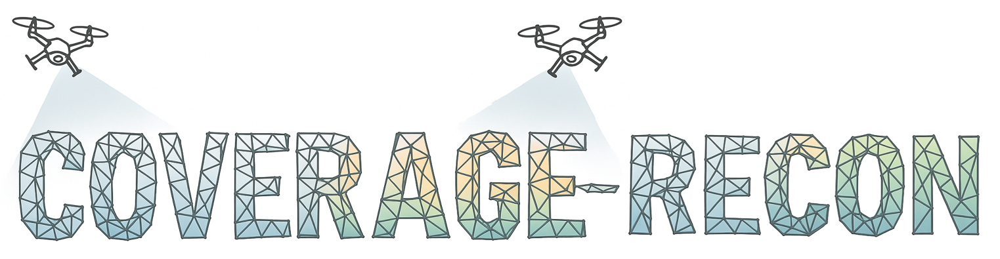

# Coverage-Recon: Coordinated Multi-Drone Image Sampling with Online Map Feedback

This repository hosts the project website for our paper **“Coverage-Recon: Coordinated Multi-Drone Image Sampling with Online Map Feedback.”**  
Authors: Muhammad Hanif, Reiji Terunuma, Takumi Sumino, Kelvin Cheng, and Takeshi Hatanaka.

🔗 **Project page:** https://htnk-lab.github.io/coverage-recon/

For an overview of the main concept, paper, videos, experiments, and reconstruction results, please refer to the project page above.

## Code

To start playing with the code, please note that **Coverage-Recon** consists of several related repositories:

1. **Coverage-Recon main algorithm repository**  
   https://github.com/htnk-lab/dji_mesh_feedback_coverage

   This is the main repository for the Coverage-Recon algorithm, including the multi-drone coverage control framework, online map-feedback mechanism, and ROS2-based implementation.

2. **NeuralRecon ROS2 connector repository**  
   https://github.com/htnk-lab/neural_recon_ros2

   This repository provides the connector between [NeuralRecon](https://zju3dv.github.io/neuralrecon/) and the ROS2 network. It enables the online 3D reconstruction output from NeuralRecon to be connected with the multi-drone system used in Coverage-Recon.

3. **Unity ROS2 simulator repository**  
   https://github.com/htnk-lab/unity-ros2-simulator

   This repository provides the Unity-based simulation environment used to mimic the real reconstruction scene and test the drone coverage/reconstruction pipeline in simulation. It is useful for running and visualizing the drone behavior, scene reconstruction workflow, and ROS2-based communication before conducting real-world experiments.

## How to Use the Code

The general workflow is as follows:

1. Set up the main Coverage-Recon algorithm repository:  
   https://github.com/htnk-lab/dji_mesh_feedback_coverage

2. Set up the NeuralRecon ROS2 connector repository:  
   https://github.com/htnk-lab/neural_recon_ros2

3. Set up the Unity ROS2 simulator repository if you want to test the pipeline in simulation:  
   https://github.com/htnk-lab/unity-ros2-simulator

4. Configure the ROS2 environment, drone simulation/experiment settings, Unity simulation scene, and NeuralRecon connection based on the instructions provided in each repository.

5. Run the Coverage-Recon pipeline by connecting the multi-drone coverage controller with the online mesh feedback generated through the NeuralRecon ROS2 connector. For simulation-based testing, the Unity ROS2 simulator can be used to mimic the reconstruction environment and visualize the drone behavior.

Please refer to the README and setup instructions in each repository for detailed installation, configuration, and execution steps.

<!-- ## About the Project

This webpage highlights our work on enhancing coverage control using real-time map feedback, integrating angle-aware coverage with real-time map feedback from [NeuralRecon](https://zju3dv.github.io/neuralrecon/). Our method leverages this feedback for improved 3D reconstruction and control using unmanned aerial vehicles (UAVs). -->

If you find our project useful, please consider citing:
```
@article{hanif2025coverage,
  title         = {Coverage-Recon: Coordinated Multi-Drone Image Sampling with Online Map Feedback},
  author        = {Hanif, Muhammad and Terunuma, Reiji and Sumino, Takumi and Cheng, Kelvin and Hatanaka, Takeshi},
  journal       = {arXiv preprint arXiv:2510.18347},
  year          = {2025}
}
```


## Website License
<a rel="license" href="http://creativecommons.org/licenses/by-sa/4.0/"></a><br />This work is licensed under a <a rel="license" href="http://creativecommons.org/licenses/by-sa/4.0/">Creative Commons Attribution-ShareAlike 4.0 International License</a>.

## Acknowledgments

This webpage template is based on the [Nerfies project website](https://nerfies.github.io). We extend our sincere thanks to [Keunhong Park](https://keunhong.com) and contributors for open-sourcing the template, which has been adapted here for our project.
